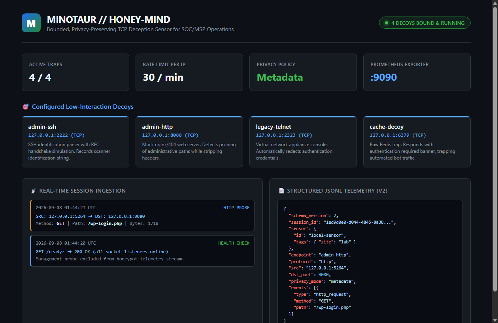
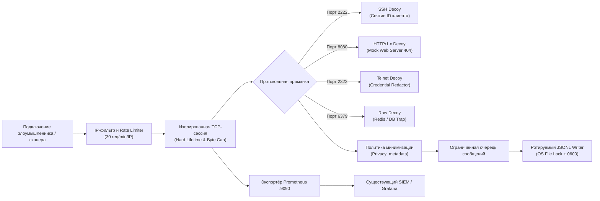

# 🪤 HONEY-MIND // minotaur

<p align="center">
  <strong>Заметить несанкционированное подключение в сети до того, как начнётся атака.</strong><br>
  <code>minotaur</code> — легковесный, автономный TCP-сенсор десепшн-технологий (deception technology) для периметра и филиальных сетей SOC/MSP.<br>
  Превращает попытки сканирования фиктивных сервисов в структурированную телеметрию — <strong>без исполнения команд злоумышленника, без баз данных и без отправки данных в облако</strong>.
</p>

<p align="center">
  
  
  
  
  
  
</p>

---

## 📸 Архитектура и дашборд сенсора

<p align="center">
  
</p>

> 💡 **Автономная работа:** сенсор не требует централизованного сервера управления. Все 4 ловушки (SSH, HTTP, Telnet, Redis) связываются с локальными портами при старте, отслеживают сессии и сбрасывают события в локальный ротируемый `honeypot.jsonl` со строгим контролем прав доступа.

---

## 🎯 Зачем нужен HONEY-MIND (minotaur)

Классические ханипоты (Honeypots) сложны в развертывании, тяжеловесны и опасны: при ошибках конфигурации злоумышленник может использовать сам ханипот как плацдарм для атаки. 

**`minotaur` спроектирован по принципу Low-Interaction & Strict Safety:**

| Характеристика | Реализация в Minotaur |
| :--- | :--- |
| 🛡 **Абсолютная безопасность хоста** | Не исполняет shell-команды клиента. Поддерживает протокольные рукопожатия ровно настолько, чтобы зафиксировать намерения сканера. |
| 🔒 **Privacy-First (Минимизация данных)** | Режим `metadata` исключает сохранение паролей Telnet, HTTP-заголовков авторизации и тел запросов, защищая от утечек случайных учетных данных. |
| 🧱 **Жёсткие лимиты ресурсов** | Ограничение максимального числа одновременных сессий, таймауты неактивности, абсолютный lifetime соединения (защита от slowloris) и лимит чтения байт. |
| 🧾 **JSONL Schema v2** | Стандартизированный машиночитаемый формат: UUID сессии, метаданные сенсора, метки времени RFC 3339, реальные адреса сокетов и коды закрытия. |
| 📡 **Наблюдаемость SOC** | Нативный экспортёр метрик Prometheus (`/metrics`), независимые эндпоинты проверки здоровья (`/readyz`, `/livez`) и учет потерь телеметрии. |
| 🔄 **Управляемый жизненный цикл** | Захват портов до запуска обработчиков, чистый graceful shutdown (SIGINT/SIGTERM) с полным дренированием очереди записи на диск. |

---

## 🏗️ Поток обработки сессии



---

## ⚡ Быстрый старт

Требуется **Rust 1.93+** и Cargo.

```bash
# 1. Клонирование репозитория
git clone https://github.com/etern1ty-crypto/HONEY-MIND.git
cd HONEY-MIND

# 2. Проверка корректности конфигурации
cargo run -- validate-config -c config.example.toml

# 3. Запуск сенсора в боевом режиме
cargo run -- run -c config.example.toml
```

При старте сенсор выводит статус готовности:
```text
OK: 4 endpoint(s); sensor=local-sensor; privacy=Metadata
```

---

## 💻 Сенсор в действии (Живые логи)

### 1. Проверка работоспособности (`minotaur healthcheck`)
Запрос эндпоинта `/readyz` с жёстким дедлайном без создания фиктивной сессии ханипота:

```bash
minotaur healthcheck -c config.example.toml
# Результат: ready
```

---

### 2. Фиксация попытки вторжения (`honeypot.jsonl`)
Пример реального события при обращении внешнего сканера к HTTP-ловушке админ-панели:

<details open>
<summary><b>Пример события JSONL (Schema v2)</b></summary>

```json
{
  "schema_version": 2,
  "ts": "2026-09-08T01:44:21.863577600Z",
  "session_id": "1ed9d0e0-d044-4845-8a38-441107b25904",
  "sensor": {
    "id": "local-sensor",
    "environment": "development",
    "tags": { "site": "lab" }
  },
  "endpoint": "admin-http",
  "protocol": "http",
  "src": "127.0.0.1:5264",
  "dst": "127.0.0.1:8080",
  "dst_port": 8080,
  "duration_ms": 0,
  "bytes_received": 171,
  "payload_captured": false,
  "bytes_truncated": false,
  "data_preview_hex": "",
  "data_preview_ascii": "",
  "privacy_mode": "metadata",
  "events": [
    {
      "type": "http_request",
      "method": "GET",
      "path": "/wp-login.php",
      "version": "HTTP/1.1",
      "host": null,
      "user_agent": null
    }
  ],
  "events_truncated": false,
  "close_reason": "server_closed"
}
```
</details>

---

## 🎯 Настроенные приманки по умолчанию

В базовом профиле `config.example.toml` активированы 4 критические приманки:

1. **`admin-ssh` (`127.0.0.1:2222`)**: Имитирует баннер `SSH-2.0-OpenSSH_9.6`. Фиксирует идентификатор сканирующего клиента.
2. **`admin-http` (`127.0.0.1:8080`)**: Имитирует веб-сервер Nginx с ответом `404 Not Found`. Отслеживает попытки подбора служебных путей (`/wp-login.php`, `/.env`).
3. **`legacy-telnet` (`127.0.0.1:2323`)**: Имитирует приглашение сетевого оборудования (`login: `). Автоматически маскирует введённые пароли.
4. **`cache-decoy` (`127.0.0.1:6379`)**: Ловушка сервиса Redis, отвечающая `-NOAUTH Authentication required.`.

---

## 🧪 Тестирование и верификация

Корректность обработки протоколов, отсутствие утечек памяти в асинхронных задачах Tokio и точность политик безопасности подтверждаются полным тестовым набором:

```bash
cargo test
```

```text
running 39 tests (lib) ... ok
running 4 tests (cli) ... ok
running 20 tests (integration) ... ok

test result: ok. 63 passed; 0 failed; 0 ignored; finished in 2.12s
```

- **39 модульных тестов**: парсинг протоколов HTTP/SSH/Telnet, кольцевые буферы, Rate Limiter, RAII-метрики.
- **4 CLI-теста**: валидация TOML, семантика параметров и устойчивость к конфликтам сокетов.
- **20 интеграционных TCP-тестов**: эмуляция атак медленного чтения (slowloris), переполнение очередей, graceful drain.

---

## 📚 Справочник документации

| Документ | Описание |
| :--- | :--- |
| 📖 [Архитектура Minotaur](docs/ARCHITECTURE.md) | Модель потоков Tokio, организация очередей и безопасность сокетов |
| ⚙️ [Конфигурация сенсора](docs/CONFIGURATION.md) | Справочник всех параметров TOML, настройка приманок и лимитов |
| 🚀 [Развертывание в инфраструктуре](docs/DEPLOYMENT.md) | Системный сервис systemd, права непривилегированного пользователя |
| 🛠 [Справочник API и CLI](docs/API.md) | Команды утилиты minotaur, параметры Prometheus и healthcheck |
| 📜 [Спецификация JSONL](docs/session.schema.json) | JSON Schema v2 структуры логов сессий |
| 🔍 [Аудит безопасности](docs/AUDIT.md) | Анализ устойчивости к DoS, переполнениям буферов и утечкам данных |
| ✅ [Протокол верификации](docs/VERIFICATION.md) | Сводка локальных проверок и тестов ревизии |
| 📝 [Changelog](CHANGELOG.md) | История версий проекта |

---

## 📜 Лицензия

Проект распространяется под открытой лицензией [MIT](LICENSE).  
Авторские права © 2026 etern1ty-crypto.
