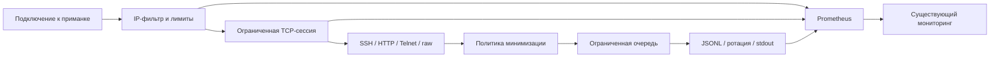

# HONEY-MIND

**Заметить подключение туда, где его не должно быть.**

`minotaur` — самостоятельно развёртываемый TCP-датчик-приманка для внутренних сетей.
Он превращает обращения к фиктивным административным сервисам в структурированные
события для SOC/MSP, не исполняя команды клиента и не требуя отдельной базы данных.

[](https://github.com/etern1ty-crypto/HONEY-MIND/actions/workflows/ci.yml)
[](rust-toolchain.toml)
[](Cargo.toml)
[](CHANGELOG.md)
[](LICENSE)
[](docs/VERIFICATION.md)

> **Статус этой поставки:** проверенная ревизия 0.2.0.
> Сборка (Rust 1.93.1 / Cargo 1.95), Clippy, rustfmt, 63 автоматических теста (юнит, CLI, интеграционные TCP)
> и контрактные проверки репозитория полностью подтверждены.
> См. [протокол проверки](docs/VERIFICATION.md).

## Для кого

Для инженера небольшого SOC или MSP, которому нужен управляемый датчик на выделенном
хосте филиала: понятная идентификация сенсора, минимальный сбор чувствительных данных,
ограничения ресурсов и интеграция с уже существующим Prometheus/сборщиком JSONL.
Это **сигнал для расследования**, а не доказательство компрометации и не замена EDR.

## Возможности

- 🪤 **Четыре приманки:** SSH identification, HTTP/1.x, Telnet login и raw TCP.
- 🔒 **Минимизация данных по умолчанию:** без raw preview, Telnet-паролей и HTTP query/header values.
- 🧱 **Предсказуемые пределы:** число сессий, абсолютный lifetime, I/O timeout, общий объём чтения и размер таблицы IP.
- 🧾 **JSONL schema v2:** UUID, sensor/site, реальные адреса сокета, события, причина закрытия и явные признаки ограничения данных.
- 📡 **Наблюдаемость:** Prometheus, отдельные liveness/readiness и счётчики потерь телеметрии.
- ♻️ **Управляемый жизненный цикл:** предварительное связывание всех портов, отслеживание дочерних задач, SIGINT/SIGTERM и дренирование очереди.
- 🗂️ **Ограниченное хранение:** ротация JSONL, приватные права файлов на Unix и OS-lock от второго писателя.

## Как устроено



## Быстрый старт

**Требования:** Rustup с Rust 1.93.1, Cargo и системный linker/C toolchain.
Основной deployment target — Linux. Интернет нужен для первой загрузки crates,
но работающий сенсор не обращается к облачным API.

Три команды из корня распакованного репозитория:

```bash
cargo build --locked --release
./target/release/minotaur print-config > minotaur.toml
./target/release/minotaur --config minotaur.toml run
```

Конфигурация безопасного старта слушает **только loopback**.
После готовой сборки настройка и запуск занимают примерно минуту;
первичная компиляция и скачивание зависимостей могут занять дольше.
Для выхода нажмите `Ctrl+C`.

## Проверить работу

В другом терминале:

```bash
./target/release/minotaur -c minotaur.toml validate-config --json
./target/release/minotaur -c minotaur.toml healthcheck
curl -i http://127.0.0.1:8080/admin
```

`404` от приманки ожидаем. Это обращение создаёт honeypot-событие.
`healthcheck` обращается к отдельному `/readyz` и не засоряет события приманки.

Для автоматической проверки протоколов, stdout и SIGTERM:

```bash
python3 examples/e2e/drive.py --binary target/release/minotaur
```

Для запуска в изолированной внутренней сети используйте
[профиль сенсора](deploy/sensor.toml) и сначала прочитайте
[инструкции развёртывания](docs/DEPLOYMENT.md). Не открывайте management-порт в Интернет.

## Честные границы

SSH здесь — **только обмен identification-строками**: без KEX, SSH-паролей или shell.
HTTP — одна ограниченная обработка заголовков, без TLS, proxy и приложения.
Raw-приманка с Redis-подобным баннером не является реализацией Redis.

Нет встроенной SIEM, GUI, SaaS-биллинга, доставки webhook, долговечного message broker,
защиты от volumetric DDoS и гарантии нераспознаваемости приманки.
При переполнении очереди новые записи теряются с увеличением счётчика.
Для полного SSH-сценария выбирайте специализированный high-interaction honeypot.

## 📚 Документация

- 📖 [Архитектура и внутреннее устройство](docs/ARCHITECTURE.md)
- ⚙️ [Настройка и конфигурация](docs/CONFIGURATION.md)
- 🚀 [Развёртывание и Production](docs/DEPLOYMENT.md)
- 🛠 [API / CLI справочник](docs/API.md)
- 🧭 [Продуктовая ниша и конкуренты](docs/PRODUCT.md)
- 🔍 [Аудит: исходные строки, исправления и регрессии](docs/AUDIT.md)
- 🧪 [Тестирование](docs/TESTING.md) · [Фактически выполненные проверки](docs/VERIFICATION.md)
- 📦 [Зависимости и supply chain](docs/DEPENDENCIES.md)
- 🧾 [JSON Schema](docs/session.schema.json) · [Пример события](examples/session.metadata.json)
- 🔐 [Политика безопасности](SECURITY.md) · [Как участвовать](CONTRIBUTING.md)

## Roadmap

1. Пройти release gates, fault-injection и нагрузочные испытания на целевой Linux-среде.
2. Проверить продуктовую гипотезу пилотами с SOC/MSP и реальной обработкой алертов.
3. При подтверждённом спросе — подписанные пакеты и централизованное управление конфигурациями.

Это планы, а не реализованные функции. Webhook, fleet UI и новые протоколы не скрыты за заглушками.

## Лицензия

[MIT](LICENSE). Исходное уведомление `Copyright (c) 2025 etern1ty-crypto` сохранено.
Используйте только в собственных сетях или с явным разрешением владельца.
Лицензии сторонних crates действуют отдельно; см. [зависимости](docs/DEPENDENCIES.md).
